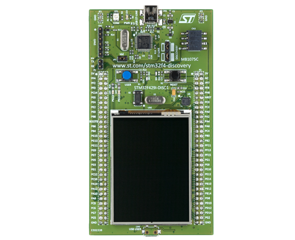

# RVC_Oses_Project

## Main Goal
Development of a Real Time Operating Systems, aims to control a Robot Vacuum Cleaner.  

## Authors 
Caviglia Alessio, Gai Omar, Gianino Fabio

## Summary of the project
This project aims to implement a real time software for a Robot vacuum cleaner.  
The robot is able to go around a room and automatically do some actions.  
The system offers the following functionalities:  
  - clean the floor (actioning brushes)
  - adjust speed and direction of movements 
  - check status of internal resources 
  - check the presence of obstacles (using proximity sensors)

## Target hardware
STM32F429I-DISCOVERY  
see  for more information.  

